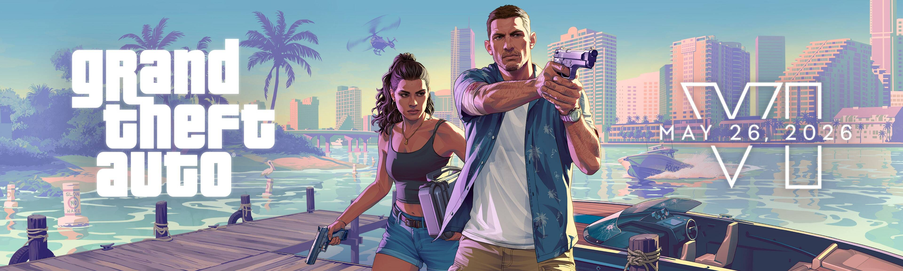

# 🎮 GTA VI - Interactive Landing Page

<div align="center">
  


[](https://gtasixx.vercel.app/)

</div>

## 🎯 Overview
An immersive, interactive landing page for Grand Theft Auto VI, featuring stunning animations, parallax effects, and a modern design that captures the essence of the game's atmosphere.


## 🛠️ Tech Stack
- ⚛️ React 19
- 🎨 TailwindCSS
- 🎬 GSAP (GreenSock Animation Platform)
- 🚀 Vite
- 🎯 TypeScript
- 🎨 Remix Icons

## 🚀 Getting Started

### Prerequisites
- Node.js (v16 or higher)
- npm or yarn

### Installation
```bash
# Clone the repository
git clone https://github.com/sudhansu-24/gtavi.git

# Navigate to project directory
cd gtavi

# Install dependencies
npm install

# Start development server
npm run dev
```

### Build
```bash
# Create production build
npm run build

# Preview production build
npm run preview
```

## 🎨 Project Structure
```
gtavi/
├── src/
│   ├── App.jsx         # Main application component
│   ├── main.jsx        # Application entry point
│   └── index.css       # Global styles
├── public/             # Static assets
└── index.html          # HTML entry point
```

## 🎮 Features in Detail
- **Interactive Loading**: Dynamic VI text mask animation
- **Parallax Effects**: Mouse movement-based parallax scrolling
- **Responsive Design**: Optimized for all screen sizes
- **Modern UI**: Clean and intuitive user interface
- **Performance**: Optimized animations and assets

## 🙏 Acknowledgments
- Rockstar Games for the inspiration
- GSAP for the amazing animation library
- Vercel for hosting
- [Sheriyans Coding School](https://www.youtube.com/@sheryians) for the amazing tutorial and guidance.

---
Made with ❤️ by SUDHANSU SEKHAR
